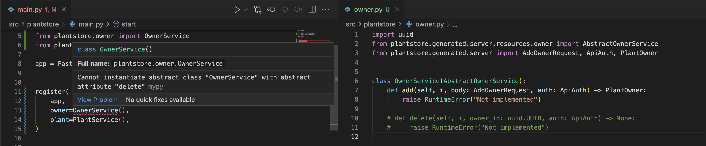

<a href="https://www.buildwithfern.com/docs/intro">
  
</a>

<div align="center">
  <a href="https://www.buildwithfern.com/docs" alt="documentation">Documentation</a>
  <span>&nbsp;&nbsp;•&nbsp;&nbsp;</span>
  <a href="https://discord.com/invite/JkkXumPzcG" alt="discord">Join the Discord</a>
</div>

<br />

<div align="center">
Backed by Y Combinator
</div>

---

# Plant Store API

<div align="center">
    <a href="https://www.npmjs.com/package/@fern-api/plantstore">
        
    </a>
    &nbsp;&nbsp;
    <a href="#">
        
    </a>
    &nbsp;&nbsp;
    <a href="https://www.postman.com/fern-api/workspace/fern-plantstore">
        
    </a>
    &nbsp;&nbsp;
    <a href="https://github.com/fern-api/plantstore-openapi">
        
    </a>
</div>

This repo contains the example Plant Store API defined in [Fern](https://github.com/fern-api/fern).
It also contains a FastAPI server that implements the API.

On the server side, Fern generates most of the code and adds compile-time safety
that the API is correctly implemented.

When a release is tagged on this repo, the Fern compiler translates the API
definition into:

- A [Node.js SDK](https://github.com/fern-api/plantstore-node)
- A [Java SDK](https://github.com/fern-api/plantstore-java)
- An [OpenAPI spec](https://github.com/fern-api/plantstore-openapi)
- A [Postman Collection](https://github.com/fern-api/plantstore-postman)

# How does it work?

The API definition is stored in [fern/api/definition](fern/api/definition). The
API Definition contains information about what endpoints, types, and errors are
used in the API. The definition is broken into smaller files such as plant.yml
and owner.yml. You can read more about the syntax of a Fern Definition in our
docs [here](https://www.buildwithfern.com/docs/definition).

In order to make sure that the definition is valid, you can use the Fern CLI.

```bash
npm install -g fern-api # Installs CLI
fern check # Checks if the definition is valid
```

# Server

The server is implemented in FastAPI. Nearly all the code is auto-generated from our
Fern definition - the generated code lives in the
[generated/](src/plantstore/generated/server) directory.

To re-generate the code, run `fern generate`. The generation is configured in
[generators.yml](fern/api/generators.yml). You can read more about the syntax of
`generators.yml` in our docs [here](https://www.buildwithfern.com/docs/compiler/generate#generators-yml).

```yaml
# generators.yml
default-group: server
groups:
  server:
    generators:
      - name: fernapi/fern-fastapi-server
        version: 0.0.33
        output:
          location: local-file-system
          path: ../../src/plantstore/generated/server
  external: ...
```

The only code we need to write manualy is the business logic of the endpoints, and
registering the endpoints.

```python
# owner.py
class OwnerService(AbstractOwnerService):
    def add(self, *, body: AddOwnerRequest, auth: ApiAuth) -> PlantOwner:
        raise RuntimeError("Not implemented")

    def delete(self, *, owner_id: uuid.UUID, auth: ApiAuth) -> None:
        raise RuntimeError("Not implemented")
```

```python
# plant.py
class PlantService(AbstractPlantService):
    def add(self, *, body: AddPlantRequest, auth: ApiAuth) -> None:
        raise RuntimeError("Not implemented")

    def find(self, *, plant_id: uuid.UUID, auth: ApiAuth) -> Plant:
        raise RuntimeError("Not implemented")

    def delete(self, *, plant_id: uuid.UUID, auth: ApiAuth) -> None:
        raise RuntimeError("Not implemented")
```

To register the endpoints, we use Fern's `register` function:

```python
app = FastAPI()

register(
    app,
    owner=OwnerService(),
    plant=PlantService(),
)
```

Beyond saving us time, Fern's adds **compile time safety** to the backend.
If we forget to implement or register any of your endpoints, or an
endpoint signature is incorrect, we'll get an error from the type checker.



## Running the server

You can run the server with:

```
poetry shell
poetry install
poetry run start
```

You can cURL the server. Right now all the endpoints throw a "not implemented"
error, so you'll get a 500 response.

```
curl \
  -X DELETE \
  --header 'Authorization: Bearer token' \
  'localhost:8080/owner/309e5e64-7c5b-4433-a645-effa0683228e'
```

# SDKs & Postman

When a release is tagged on this repo, Fern will generate SDKs and
a Postman collection. This is handled by a [GitHub workflow](https://github.com/fern-api/plantstore-api/blob/main/.github/workflows/ci.yml),
which runs:

```
fern generate --group external --version <version>
```

This generates:

- A [Node.js SDK](https://github.com/fern-api/plantstore-node)
- A [Java SDK](https://github.com/fern-api/plantstore-java)
- An [OpenAPI spec](https://github.com/fern-api/plantstore-openapi)
- A [Postman Collection](https://github.com/fern-api/plantstore-postman)

These outputs are configured in [generators.yml](fern/api/generators.yml). You
can read more about the syntax of `generators.yml` in our docs
[here](https://www.buildwithfern.com/docs/compiler/generate#generators-yml).

```yaml
# generators.yml
groups:
  server: ...
  external:
    generators:
      - name: fernapi/fern-typescript-sdk
        version: 0.0.257
        output:
          location: npm
          package-name: "@fern-api/plantstore"
          token: ${FERN_NPM_TOKEN}
        github:
          repository: fern-api/plantstore-node
      - name: fernapi/fern-java-sdk
        version: 0.0.132
        output:
          location: maven
          coordinate: io.github.fern-api:plantstore
          username: ${FERN_MAVEN_USERNAME}
          password: ${FERN_MAVEN_PASSWORD}
        github:
          repository: fern-api/plantstore-java
      - name: fernapi/fern-openapi
        version: 0.0.15
        github:
          repository: fern-api/plantstore-openapi
      - name: fernapi/fern-postman
        version: 0.0.33
        output:
          location: postman
          api-key: ${FERN_POSTMAN_API_KEY}
          workspace-id: ${FERN_POSTMAN_WORKSPACE_ID}
        github:
          repository: fern-api/plantstore-postman
```

# Community

Join the [Discord](https://discord.com/invite/JkkXumPzcG)!
